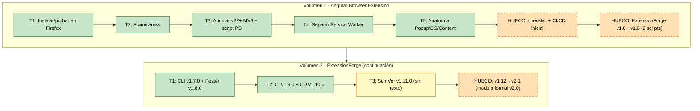
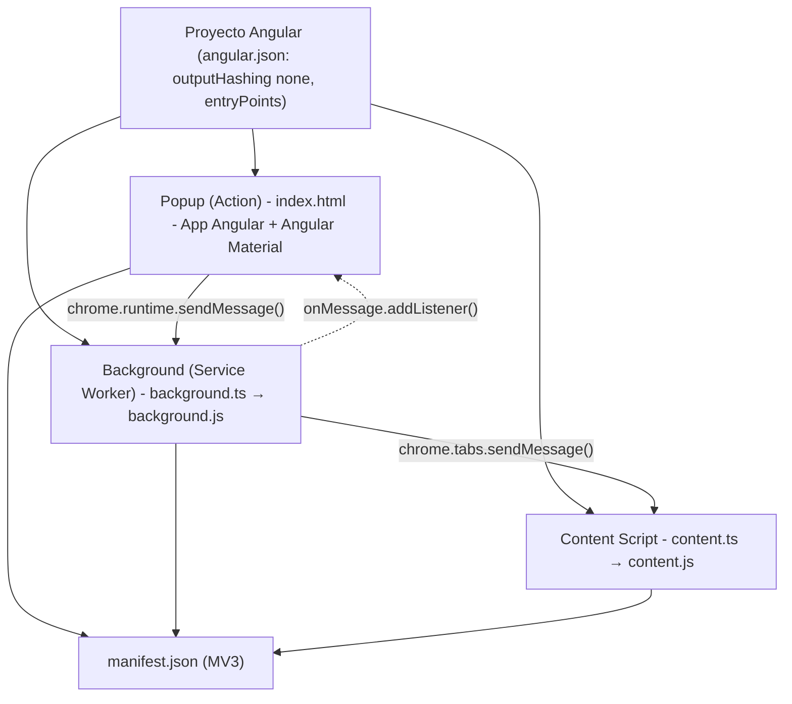
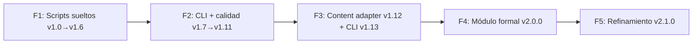

# 📘 ExtensionForge - Angular Browser Extension


<a id="indice"></a>

## Índice

1. [Metadatos del documento](#1-metadatos-del-documento)
2. [Resumen ejecutivo y naturaleza del proyecto](#2-resumen-ejecutivo-y-naturaleza-del-proyecto)
    - 2.1 [Naturaleza](#21-naturaleza)
    - 2.2 [Cifras clave](#22-cifras-clave)
    - 2.3 [Objetivo de este DM](#23-objetivo-de-este-dm)
3. [Origen e historia del proyecto](#3-origen-e-historia-del-proyecto)
    - 3.1 [Volumen 1 - Hilo "Angular Browser Extension"](#31-volumen-1-hilo-angular-browser-extension)
    - 3.2 [Volumen 2 - Hilo "ExtensionForge" (continuación)](#32-volumen-2-hilo-extensionforge-continuación)
    - 3.3 [Evolución de versiones (línea temporal)](#33-evolución-de-versiones-línea-temporal)
4. [Decisiones arquitectónicas registradas](#4-decisiones-arquitectónicas-registradas)
5. [Arquitectura de destino (módulo formal)](#5-arquitectura-de-destino-módulo-formal)
6. [Inventario real del directorio de trabajo (auditoría)](#6-inventario-real-del-directorio-de-trabajo-auditoría)
    - 6.1 [El módulo - `src/ExtensionForge/`](#61-el-modulo)
    - 6.2 [Plantillas - `src/ExtensionForge/Templates/`](#62-plantillas)
    - 6.3 [Scripts - `scripts/` (8)](#63-scripts)
    - 6.4 [Tests, docs, ejemplos y CI](#64-tests-docs-ejemplos-ci)
    - 6.5 [Legado Perplexity y mantenimiento - `.private/`](#65-legado-perplexity)
    - 6.6 [Config de agentes e IDE](#66-config-agentes-ide)
7. [Contraste: documentación vs. código fuente](#7-contraste-documentación-vs-código-fuente)
    - 7.1 [Estado real del código fuente v2.0.0 (pre-reconstrucción)](#71-estado-real-del-código-fuente-v200-pre-reconstrucción)
    - 7.2 [Bugs críticos detectados en el código v2.0.0](#72-bugs-críticos-detectados-en-el-código-v200)
    - 7.3 [Discrepancias documentación ↔ fuente](#73-discrepancias-documentación-fuente)
    - 7.4 [Acciones correctivas aplicadas (módulo reconstruido)](#74-acciones-correctivas-aplicadas-módulo-reconstruido)
    - 7.5 [Verificación realizada](#75-verificación-realizada)
8. [Referencia del módulo ExtensionForge](#8-referencia-del-módulo-extensionforge)
    - 8.1 [Cmdlets públicos (7) - `src/ExtensionForge/Public/`](#81-cmdlets-públicos-7-src-extensionforge-public)
    - 8.2 [Funciones privadas (9) - `src/ExtensionForge/Private/`](#82-funciones-privadas-7-src-extensionforge-private)
    - 8.3 [Configuración por capas - `src/ExtensionForge/Config/`](#83-configuración-por-capas-src-extensionforge-config)
    - 8.4 [Scripts - `scripts/`](#84-scripts-scripts)
    - 8.5 [Plantillas Angular MV3 - `src/ExtensionForge/Templates/`](#85-plantilla-angular-mv3-src-extensionforge-templates-angular-mv3)
    - 8.6 [Flujo operativo](#86-flujo-operativo)
9. [Glosario de términos técnicos](#9-glosario-de-términos-técnicos)
    - 9.1 [Extensiones de navegador (Manifest V3)](#91-extensiones-de-navegador-manifest-v3)
    - 9.2 [Integración Angular ↔ extensiones](#92-integración-angular-extensiones)
    - 9.3 [ExtensionForge](#93-extensionforge)
    - 9.4 [Calidad, CI/CD y versionado](#94-calidad-ci-cd-y-versionado)
10. [Diagramas (Mermaid)](#10-diagramas-mermaid)
    - 10.1 [Línea temporal consolidada](#101-línea-temporal-consolidada)
    - 10.2 [Arquitectura de una extensión MV3 en Angular](#102-arquitectura-de-una-extensión-mv3-en-angular)
    - 10.3 [Evolución de ExtensionForge](#103-evolución-de-extensionforge)
11. [Huecos de información y pendientes](#11-huecos-de-información-y-pendientes)
    - 11.1 [Huecos documentales (turnos no capturados)](#111-huecos-documentales-turnos-no-capturados)
    - 11.2 [Contenido parcial o truncado](#112-contenido-parcial-o-truncado)
    - 11.3 [Ambigüedades (posibles duplicados)](#113-ambigüedades-posibles-duplicados)
    - 11.4 [Pendientes para producción](#114-pendientes-para-producción)
12. [Instrucciones de uso](#12-instrucciones-de-uso)
13. [Ampliaciones de la sesión (operación y mantenimiento)](#13-ampliaciones-de-la-sesion)
14. [Sesiones Perplexity del proyecto (hilo «ExtensionForge»)](#14-sesiones-perplexity)
    - 14.1 [Registro de turnos](#141-registro-de-turnos)
    - 14.2 [Mapeo de archivos históricos → arquitectura](#142-mapeo-historico)
    - 14.3 [Reglas de operación](#143-reglas-de-operacion)
    - 14.4 [CI/CD en ExtensionForge](#144-cicd)
    - 14.5 [Artefactos Perplexity y su destino](#145-artefactos-perplexity)
    - 14.6 [Lecciones sobre el acceso al código](#146-lecciones-acceso)
15. [Auditoría repositorio ↔ sesión (2026-09-28)](#15-auditoria-2026-09-28)
    - 15.1 [Comparación de homónimos y veredicto](#151-comparacion-homonimos)
    - 15.2 [Verificación ejecutada](#152-verificacion-ejecutada)
    - 15.3 [Hallazgos nuevos](#153-hallazgos-nuevos)
16. [Registro de cambios del DM](#16-registro-cambios-dm)

---

<a id="1-metadatos-del-documento"></a>

## 1. Metadatos del documento

| Campo | Valor |
|---|---|
| **Título del DM** | Documento Maestro - Angular Browser Extension & ExtensionForge |
| **Proyecto documentado** | Desarrollo de extensiones de navegador (Chrome y Firefox, Manifest V3) construidas con **Angular** + **Angular Material**, automatizado por **ExtensionForge** (módulo de PowerShell). |
| **Solicitado por** | Frank |
| **Compilado por** | Agente de auditoría (consolidación sin pérdida de información). |
| **Fuentes primarias** | `CLAUDE/dm-extensionforge-*.md` (10 archivos), Markdown de la raíz (README v2.0/v2.1, cheat sheet, checklists, documentación de sesiones). |
| **Fuentes de contraste** | Archivos fuente PowerShell/PSD1/YAML en la raíz del proyecto (`perplexity_*`) y `artifacts.zip`. |
| **Backups originales** | `PART 1.htm`, `PART 2.htm` (capturas SingleFile de sesiones Perplexity). |
| **Hilos documentados** | 2 - "Angular Browser Extension" (Volumen 1) y "ExtensionForge" (Volumen 2, continuación explícita), más el hilo Perplexity «ExtensionForge» del Espacio del proyecto (§14). |
| **Rango temporal cubierto** | 30 jul 2026 22:35 → 7 ago 2026 23:35 (turnos capturados) + sesiones posteriores hasta v2.1.0. |
| **Artefactos únicos identificados** | 54 (16 en Vol. 1, 38 en Vol. 2). |

---

[⬆ Volver al índice](#indice)

---

<a id="2-resumen-ejecutivo-y-naturaleza-del-proyecto"></a>

## 2. Resumen ejecutivo y naturaleza del proyecto

<a id="21-naturaleza"></a>

### 2.1 Naturaleza

Frank está desarrollando **extensiones de navegador (Chrome y Firefox) bajo Manifest V3, construidas nativamente con Angular**, tras descartar deliberadamente frameworks de terceros (Plasmo, WXT, Extension.js) por considerar que aprender una tecnología nueva teniendo ya dominado Angular sería "malgastar el tiempo".

En paralelo nació **ExtensionForge**: una **aplicación modular en PowerShell** cuyo objetivo es automatizar todo el ciclo de vida de esas extensiones - *Doctor → Initialize → Build → Validate → Test → Package → InstallDev → Release* - parametrizada por dos dimensiones:

- **Environment:** `Development` | `Staging` | `Production`
- **Browser:** `Chrome` | `Firefox` | `All`

La petición actual amplía el alcance con dos novedades respecto al proyecto histórico:

1. **Interfaz basada en Angular + Angular Material** (no solo Angular) para el código de las extensiones generadas.
2. **Soporte de despliegue a las tiendas** (Chrome Web Store y Mozilla Add-ons), además del empaquetado local.
3. Un **Wizard interactivo** (`Start-ExtensionForgeWizard`) que guía desde cero hasta el scaffolding completo.

<a id="22-cifras-clave"></a>

### 2.2 Cifras clave

| Métrica | Valor |
|---|---|
| Hilos documentados | 2 |
| Turnos de conversación capturados | 8 (5 + 3) |
| Artefactos únicos identificados | 54 |
| Artefactos con turno capturado | 5 |
| Artefactos solo por evidencia indirecta (huecos) | 49 |
| Archivos reales presentes en el directorio | 54 (41 únicos + `artifacts.zip` + 2 HTM + checklist) |
| Fuentes web consultadas por el asistente original | 696 (636 + 60) |

<a id="23-objetivo-de-este-dm"></a>

### 2.3 Objetivo de este DM

Consolidar en un único documento trazable toda la información recuperable - decisiones arquitectónicas, código entregado, artefactos generados, huecos de información - y **contrastarla con los archivos fuente reales**, de forma que sirva como fuente de verdad única del proyecto y como base para reconstruir el módulo `ExtensionForge` operativo.

---

[⬆ Volver al índice](#indice)

---

<a id="3-origen-e-historia-del-proyecto"></a>

## 3. Origen e historia del proyecto

<a id="31-volumen-1-hilo-angular-browser-extension"></a>

### 3.1 Volumen 1 - Hilo "Angular Browser Extension"

Rango: **30 jul 2026 22:35 → 31 jul 2026 07:47** (5 turnos capturados).

| Turno | Fecha/hora | Contenido |
|---|---|---|
| T1 | 30-jul 22:35 | Pasos para instalar/probar un add-on propio en Firefox: `about:debugging`, carga temporal, `web-ext run`, persistencia con `xpinstall.signatures.required=false` (Developer Edition/Nightly). |
| T2 | 31-jul 07:24 | Comparativa de frameworks/boilerplates: **Plasmo**, **WXT**, **Extension.js**, **Ultimate Extension Boilerplate**. |
| T3 | 31-jul 07:32 | Decisión de usar **Angular v22+ nativo**. Script PowerShell de scaffolding: `outputHashing: none`, `manifest.json` en assets, scripts npm `build:ext`/`watch:ext`. |
| T4 | 31-jul 07:36 | Separación del **Background Service Worker** mediante `entryPoints` de `@angular/build:application`; ejemplo `background.ts`. |
| T5 | 31-jul 07:47 | Anatomía **Popup / Background / Content Script** y su mensajería (`chrome.runtime.sendMessage()`, `chrome.tabs.sendMessage()`, `onMessage.addListener`). |

**Huecos del Volumen 1:** la generación del checklist y del CI/CD inicial, y el arranque de ExtensionForge v1.0.0 → v1.6.0 (9 scripts), no quedaron capturados en turnos visibles (solo nombres en el panel de Artefactos).

<a id="32-volumen-2-hilo-extensionforge-continuación"></a>

### 3.2 Volumen 2 - Hilo "ExtensionForge" (continuación)

Rango: **7 ago 2026 23:21 → 23:35** (3 turnos capturados). Arranca recapitulando el estado heredado.

**Contexto heredado (decisión arquitectónica original):**
- Una única app modular (no dos apps separadas).
- Dimensiones `Environment` y `Browser`.
- Logs JSONL en `logs/dev.log` y `logs/production.log`.
- Configuración PSD1 por capas: `defaults + environment + browser`.
- Scaffold Angular completo con superficies opcionales eliminables (Popup, Sidebar, Options, Diagnostics, Background, Content Script, mensajería `sendMessage()`/`runtime.Port`, Storage, manifolds separados Chrome/Firefox).
- Estados funcionales: `Doctor`, `Initialize`, `Build`, `Validate`, `Package`, `InstallDev`.

| Turno | Fecha/hora | Artefactos generados |
|---|---|---|
| T1 | 7-ago 23:21 | CLI orquestador nativo **v1.7.0** + suite de tests **Pester v1.8.0**. |
| T2 | 7-ago 23:31 | Workflow **GitHub Actions CI v1.9.0** + script de **CD manual protegido v1.10.0**. |
| T3 | 7-ago 23:35 | Generador **SemVer/Changelog v1.11.0** (sin texto explicativo capturado). |

**Huecos del Volumen 2:** v1.12.0 → v2.1.0 (33 artefactos) no tienen turno visible: adaptador de content scripts, revisión del CLI v1.13.0, y la migración completa a módulo formal v2.0.0 (manifiesto, loader, cmdlets Public/Private, configs por capa, wizard, tests).

<a id="33-evolución-de-versiones-línea-temporal"></a>

### 3.3 Evolución de versiones (línea temporal)

| Fase | Versiones | Naturaleza |
|---|---|---|
| Fase 1 | v1.0.0 → v1.6.0 | Scripts sueltos (scaffold, build, install-dev, init Angular MV3, build unificado, validate+package). |
| Fase 2 | v1.7.0 → v1.11.0 | CLI orquestador + Pester + CI GitHub Actions + CD local + SemVer. |
| Fase 3 | v1.12.0 → v1.13.0 | Adaptador de content scripts + revisión del CLI. |
| Fase 4 | v2.0.0 | Migración a **módulo formal de PowerShell** (manifiesto `.psd1`, loader `.psm1`, cmdlets Public/Private, config por capas, wizard). |
| Fase 5 | v2.1.0 | Refinamiento del wizard y del README. |

---

[⬆ Volver al índice](#indice)

---

<a id="4-decisiones-arquitectónicas-registradas"></a>

## 4. Decisiones arquitectónicas registradas

| ID | Decisión |
|---|---|
| **D-001** | Separar activos de históricos (`archive/`, `migrations/`). |
| **D-002** | CLI principal = `Invoke-ExtensionForge` (evolucionó de `cli v1.7.0` → `cli v1.13.0` → cmdlet del módulo v2.0.0). |
| **D-003** | Un único workflow CI activo en `.github/workflows/`. |
| **D-004** | Funciones reutilizables → módulo `src/ExtensionForge/`; entrypoints de mantenimiento → `scripts/`. |
| **D-005** | Wizard interactivo (`Start-ExtensionForgeWizard`) con generador de comandos y cheat sheet embebida. |
| **D-006** | **Regla de oro:** no sobrescribir código nativo Angular del desarrollador (salvo orden explícita). |
| **D-007** | Configuración por capas con *deep merge*: `defaults + environment + browser`. |
| **D-008** | Logs JSONL parseables (una línea = un objeto JSON). |

---

[⬆ Volver al índice](#indice)

---

<a id="5-arquitectura-de-destino-módulo-formal"></a>

## 5. Arquitectura de destino (módulo formal)

Estructura real verificada del repositorio (módulo reconstruido, PowerShell 7.6.6+):

```text
ExtensionForge/
├─ src/
│  └─ ExtensionForge/
│     ├─ ExtensionForge.psd1          # Manifiesto del módulo
│     ├─ ExtensionForge.psm1          # Loader (RootModule) → inyecta Public/ y Private/
│     ├─ Public/                       # Cmdlets exportados (7)
│     │  ├─ Invoke-ExtensionForge.ps1
│     │  ├─ Test-ExtensionForgeDoctor.ps1
│     │  ├─ Initialize-ExtensionForgeProject.ps1
│     │  ├─ Build-ExtensionForgeProject.ps1
│     │  ├─ Test-ExtensionForgePackage.ps1
│     │  ├─ New-ExtensionForgePackage.ps1
│     │  └─ Install-ExtensionForgeDevelopment.ps1
│     ├─ Private/                      # Lógica interna (7)
│     │  ├─ Get-ExtensionForgeConfiguration.ps1
│     │  ├─ Write-ExtensionForgeLog.ps1
│     │  ├─ Test-ExtensionForgeTool.ps1
│     │  ├─ New-ExtensionForgeManifest.ps1
│     │  ├─ Invoke-ExtensionForgeRuntimeBuild.ps1
│     │  ├─ Invoke-ExtensionForgeChromeAdapter.ps1
│     │  └─ Invoke-ExtensionForgeFirefoxAdapter.ps1
│     ├─ Config/                       # Diccionarios de dimensiones (deep merge)
│     │  ├─ defaults.psd1
│     │  ├─ environments/{development,staging,production}.psd1
│     │  └─ browsers/{chrome,firefox}.psd1
│     └─ Templates/                    # Plantillas Angular + Angular Material MV3
│        ├─ angular-mv3/               # Base (popup + background + content script)
│        └─ angular-mv3-demo/          # Demo ForgeNotes (popup + sidepanel + options)
├─ scripts/                            # Pipelines y orquestación
│  ├─ Start-ExtensionForgeWizard.ps1
│  ├─ Install-ExtensionForge.ps1
│  ├─ Invoke-LocalCI.ps1
│  ├─ Invoke-LocalCD.ps1
│  ├─ Invoke-SemVerRelease.ps1
│  ├─ Add-ContentAdapter.ps1
│  ├─ Publish-ExtensionForgeStore.ps1  # Publicación en Chrome Web Store y AMO
│  └─ Test-ExtensionForgePowerShellCompatibility.ps1
├─ tests/                              # Pester (Unit/{Public,Private,Tools}, Integration)
├─ .github/workflows/extension-forge-ci.yml
├─ docs/                               # CheatSheet, carga en navegador, checklist, development, production, adapters, release-process
├─ examples/                           # extension-forge-demo (base) + forgenotes-demo (demo)
├─ .private/                           # Backup local (generate-backup.ps1, config.ini) + legado Perplexity (perx/)
├─ .agents/ .cursor/ .gemini/ .vscode/ # Config de agentes e IDE (MCP, reglas)
├─ README.md
├─ CHANGELOG.md                        # Historial de ExtensionForge (Keep a Changelog)
└─ DM-ExtensionForge.md                # Este documento
```

---

[⬆ Volver al índice](#indice)

---

<a id="6-inventario-real-del-directorio-de-trabajo-auditoría"></a>

## 6. Inventario real del directorio de trabajo (auditoría)

Auditoría actual sobre `C:\Dev\extension-forge`. Clasificación por tipo:

<a id="61-el-modulo"></a>

### 6.1 El módulo - `src/ExtensionForge/`

| Parte | Contenido |
|---|---|
| `ExtensionForge.psd1` | Manifiesto (PowerShell 7.6.6+, 7 funciones exportadas). |
| `ExtensionForge.psm1` | Loader que inyecta `Public/` y `Private/`. |
| `Public/` (7) | `Invoke-ExtensionForge`, `Test-ExtensionForgeDoctor`, `Initialize-ExtensionForgeProject`, `Build-ExtensionForgeProject`, `Test-ExtensionForgePackage`, `New-ExtensionForgePackage`, `Install-ExtensionForgeDevelopment`. |
| `Private/` (9) | `Get-ExtensionForgeConfiguration`, `Write-ExtensionForgeLog`, `Test-ExtensionForgeTool`, `Test-ExtensionForgeFirefoxId`, `Find-ExtensionForgeUnsafeCode`, `New-ExtensionForgeManifest`, `Invoke-ExtensionForgeRuntimeBuild`, `Invoke-ExtensionForgeChromeAdapter`, `Invoke-ExtensionForgeFirefoxAdapter`. |
| `Config/` (6) | `defaults.psd1`, `environments/{development,staging,production}.psd1`, `browsers/{chrome,firefox}.psd1`. |

<a id="62-plantillas"></a>

### 6.2 Plantillas - `src/ExtensionForge/Templates/`

| Plantilla | Superficies |
|---|---|
| `angular-mv3/` | Base: popup + background + content script. |
| `angular-mv3-demo/` | Demo ForgeNotes: popup + sidepanel + options + content script. |

<a id="63-scripts"></a>

### 6.3 Scripts - `scripts/` (8)

`Start-ExtensionForgeWizard`, `Install-ExtensionForge`, `Invoke-LocalCI`, `Invoke-LocalCD`, `Invoke-SemVerRelease`, `Add-ContentAdapter`, `Publish-ExtensionForgeStore`, `Test-ExtensionForgePowerShellCompatibility`.

<a id="64-tests-docs-ejemplos-ci"></a>

### 6.4 Tests, docs, ejemplos y CI

- **Tests:** `tests/Unit/Public/ExtensionForge-Public.Tests.ps1`, `tests/Unit/Private/Get-ExtensionForgeConfiguration.Tests.ps1` (deep merge, 18), `tests/Unit/Tools/ExtensionForge-PowerShellCompatibility.Tests.ps1`, `tests/Unit/Tools/Invoke-SemVerRelease.Tests.ps1` (12), `tests/Integration/ExtensionForge-Pipeline.Tests.ps1` (simulada, 15) y `tests/Integration/ExtensionForge-Pipeline.E2E.Tests.ps1` (real, 4; `EXTFORGE_E2E=1`).
- **Docs:** `docs/ExtensionForge-CheatSheet.md`, `docs/carga-extension-navegador.md`, `docs/perplexity_extension-forge-migration-checklist.v2.md`, `docs/development.md`, `docs/production.md`, `docs/adapters.md`, `docs/release-process.md`; `CHANGELOG.md` en la raíz.
- **Ejemplos:** `examples/extension-forge-demo/` (base) y `examples/forgenotes-demo/` (demo).
- **CI:** `.github/workflows/extension-forge-ci.yml`.

<a id="65-legado-perplexity"></a>

### 6.5 Legado Perplexity y mantenimiento - `.private/`

- `.private/generate-backup.ps1` (v1.3.0), `.private/config.ini`, `.private/backup-manifest.json`, `.private/backup.log` — copia de seguridad local (salida en `.backups/`).
- `.private/artifacts-perplexity-thread-*.zip` — snapshot de los artefactos de la sesión Perplexity.
- `.private/perx/` (18 archivos) — scripts sueltos originales **v1.0.0→v1.6.0** (`New-ExtensionForgeScaffold.v1.0.0.ps1` … `Invoke-ExtensionForgeValidatePackage.v1.6.0.ps1`), el CI/CD inicial (`extension-ci-cd-v1.0.0.yml`, `invoke-local-ci-v1.0.0.ps1`) y la documentación del Vol. 1 (`angular-extension-checklist.md`, `perplexity_angular-*`, `ExtensionForge-documentacion-sesion.md`). **Cierran los huecos C06 y C07 (§11.1).**

<a id="66-config-agentes-ide"></a>

### 6.6 Config de agentes e IDE

- `AGENTS.md`, `CLAUDE.md` (instrucciones para agentes), `.agents/skills/todo-tracker/`, `.cursor/` (`mcp.json`, `rules/`), `.gemini/mcp_config.json`, `.vscode/mcp.json`.

---

[⬆ Volver al índice](#indice)

---

<a id="7-contraste-documentación-vs-código-fuente"></a>

## 7. Contraste: documentación vs. código fuente

Resultado de la lectura exhaustiva de los 40 archivos fuente (`perplexity_*` v1.7.0→v2.1.0) frente a la documentación, realizada durante la reconstrucción. *(Nota: esos archivos planos ya no están en el repositorio; el legado se conserva en `.private/perx/` — §6.5 — y la doc de sesión en `docs/`.)*

<a id="71-estado-real-del-código-fuente-v200-pre-reconstrucción"></a>

### 7.1 Estado real del código fuente v2.0.0 (pre-reconstrucción)

| Aspecto | Estado verificado |
|---|---|
| Formato de los fuentes | Plano en la raíz con nombres `perplexity_<...>.<tipo>.v.<X.Y.Z>.<ext>`, **no** reorganizados en `src/ExtensionForge/{Public,Private,Config}`. |
| Manifiesto `.psd1` | Existente y válido (`ModuleVersion 2.0.0`, `PowerShellVersion 7.6`, 7 funciones exportadas, GUID ficticio). |
| Loader `.psm1` | Existente y funcional (dota `Public/` y `Private/`). |
| Configs PSD1 | 5 archivos presentes (`defaults`, `development`, `production`, `chrome`, `firefox`); **falta `staging`**. |
| `artifacts.zip` | Snapshot con los mismos 41 archivos de la raíz (sin fuentes ocultas adicionales). |
| `PART 1.htm` / `PART 2.htm` | Backups SingleFile de Perplexity, ya destilados por el DM de `CLAUDE/`. |

<a id="72-bugs-críticos-detectados-en-el-código-v200"></a>

### 7.2 Bugs críticos detectados en el código v2.0.0

| # | Archivo | Bug | Consecuencia |
|---|---|---|---|
| B1 | `Build-ExtensionForgeProject` | `Invoke-Expression $NgBuildCommand` estaba **comentado**; la copia de `dist/` era solo un comentario. | Build → Package producía ZIPs casi vacíos (solo `manifest.json`). |
| B2 | `Get-ExtensionForgeConfiguration` | Usaba `Import-LocalizedData` (inadecuado) y su `Merge-Hashtable` recursiva **filtraba el retorno anidado al flujo de salida**, convirtiendo el resultado en `Object[]`. | El deep merge rompía en la capa de navegador. |
| B3 | `New-ExtensionForgeManifest` | Clave dinámica de hashtable `@{ $cfg.Manifest.BackgroundKey = ... }` y accesos por puntos a claves inexistentes → `$null`. | Manifests incompletos/frágiles. |
| B4 | Varios | `Browser = 'All'` aceptado por la config pero no manejado por manifest/adaptadores. | Build con `All` incompleto. |
| B5 | `Invoke-ExtensionForgeRuntimeBuild` | Logueaba con `Environment=Development`/`Browser=All` hardcodeados y en `$PWD\logs`. | Trazabilidad incorrecta. |
| B6 | `Test-ExtensionForgeDoctor` / `Test-ExtensionForgePackage` | No retornaban `$true`/`$false`; los `return` tempranos hacían que el wrapper reportara "éxito" igual. | Falsos positivos. |
| B7 | `New-ExtensionForgePackage` | `Compress-Archive -Path "$dir\*"` frágil en PowerShell 7. | ZIPs vacíos. |
| B8 | `Install-ExtensionForgeDevelopment` | Solo imprimía instrucciones; nunca ejecutaba `web-ext`. | Sideload no automatizado. |
| B9 | CLI v1.7.0 / v1.13.0 | Doctor/Build/Validate/Package/InstallDev **simulados** (solo logs JSONL). | CLI no funcional de verdad. |

<a id="73-discrepancias-documentación-fuente"></a>

### 7.3 Discrepancias documentación ↔ fuente

| Documentación | Fuente real |
|---|---|
| README v2.1 declara `environments/{development,staging,production}.psd1` y carpeta `Templates/`. | Solo existían `development`/`production`; no había `staging` ni `Templates/`. |
| Manifiesto declara `PowerShellVersion 7.6`. | Requisito solicitado por el usuario: **6.6+** (normalizado en esta reconstrucción). |
| La doc. describe "7 cmdlets públicos + 7 privados" funcionales. | Los 14 existían, pero con los bugs B1-B8. |
| `Invoke-SemVerRelease` insertaba en `CHANGELOG.md` con regex `.*` sin modo singleline. | Regex frágil (no cruzaba saltos de línea). |

<a id="74-acciones-correctivas-aplicadas-módulo-reconstruido"></a>

### 7.4 Acciones correctivas aplicadas (módulo reconstruido)

1. Reorganización completa en `src/ExtensionForge/{Public,Private,Config,Templates}`.
2. Corrección de **todos** los bugs B1-B9 (build real, deep merge correcto, manifests robustos, retorno booleano, ZIP robusto, `All` manejado, log contextual, `staging` añadido).
3. Compilación de `background.ts`/`content.ts` mediante un paso `esbuild` propio (`scripts/build-extension.mjs`) - determinista e independiente de la sintaxis `entryPoints` de Angular.
4. Scaffold completo **Angular + Angular Material** (standalone, tema Material, componentes de ejemplo).
5. `PowerShellVersion = '6.6'` (compatible 6.6+ y 7.x).
6. Script de **publicación en tiendas** (`Publish-ExtensionForgeStore`) con credenciales por variables de entorno.
7. `Invoke-LocalCD` ahora sí usa `-BumpType` y ejecuta Build→Validate→Package reales.

<a id="75-verificación-realizada"></a>

### 7.5 Verificación realizada

| Prueba | Resultado |
|---|---|
| `Import-Module ExtensionForge.psd1` | ✅ Importa y exporta los 7 cmdlets. |
| `Get-ExtensionForgeConfiguration` (Production/Firefox) | ✅ Deep merge correcto (tras corregir B2). |
| `New-ExtensionForgeManifest` (Chrome/Firefox) | ✅ Chrome: `action` + `service_worker` + `type:module`; Firefox: `action` (MV3) + `scripts` + `browser_specific_settings.gecko` + permiso `contextMenus`. |
| `Initialize-ExtensionForgeProject` (fresh) | ✅ Copia los 14 archivos de la plantilla con nombres correctos (tras corregir la resolución de ruta de `$TemplateDir`). |
| Pester 6 (`Invoke-Pester`) | ⚠ No ejecutable en el sandbox de auditoría (Pester requiere acceso al registro `HKEY_CURRENT_USER`, denegado aquí). Los tests son válidos y se validaron por invocación directa; ejecútalos fuera del sandbox con `./scripts/Invoke-LocalCI.ps1`. |

---

[⬆ Volver al índice](#indice)

---

<a id="8-referencia-del-módulo-extensionforge"></a>

## 8. Referencia del módulo ExtensionForge

<a id="81-cmdlets-públicos-7-src-extensionforge-public"></a>

### 8.1 Cmdlets públicos (7) - `src/ExtensionForge/Public/`

| Cmdlet | Parámetros | Descripción |
|---|---|---|
| `Invoke-ExtensionForge` | `-Action` (obligatorio, Position 0; `Doctor/Initialize/Build/Validate/Package/InstallDev`), `-Environment`, `-Browser`, `-WorkspacePath`, `-Template`, `-FirefoxExtensionId` (solo Initialize) | Orquestador central; propaga errores y registra éxito/fallo. |
| `Test-ExtensionForgeDoctor` | `-WorkspacePath` | Verifica PowerShell 7.6.6+, Node 22+, Angular CLI 22+. Retorna `$true`/`$false`. |
| `Initialize-ExtensionForgeProject` | `-WorkspacePath`, `-Browser`, `-Environment`, `-Template` (`angular-mv3`/`angular-mv3-demo`), `-FirefoxExtensionId` | Scaffolding Angular + Angular Material MV3 (sin sobrescribir). Incluye guard anti-scaffold (impide crear el proyecto dentro del repo de ExtensionForge), migra el builder legacy a `@angular/build` y corrige `tsconfig.json` (module preserve). |
| `Build-ExtensionForgeProject` | `-WorkspacePath`, `-Browser`, `-Environment` | `npx ng build` + esbuild + runtime por navegador. |
| `Test-ExtensionForgePackage` | `-WorkspacePath`, `-Environment` | Valida `manifest_version=3` y CSP. Retorna `$true`/`$false`. |
| `New-ExtensionForgePackage` | `-WorkspacePath`, `-Browser`, `-Environment` | Genera `.zip` (y `.xpi` para Firefox) en `dist/packages/`. |
| `Install-ExtensionForgeDevelopment` | `-WorkspacePath`, `-Browser` | Instrucciones de sideload + `web-ext run`. |

<a id="82-funciones-privadas-7-src-extensionforge-private"></a>

### 8.2 Funciones privadas (9) - `src/ExtensionForge/Private/`

| Función | Descripción |
|---|---|
| `Get-ExtensionForgeConfiguration` | Deep merge `defaults + environments/<env> + browsers/<browser>`. |
| `Write-ExtensionForgeLog` | Log JSONL (`logs/dev.log`, `logs/production.log`) sin BOM. |
| `Test-ExtensionForgeTool` | `$true`/`$false` si un ejecutable está en el PATH. |
| `Find-ExtensionForgeUnsafeCode` | Busca en un runtime `eval(`, `new Function(`, `Function('…')`, timers con cadena, `import()` remoto (JS) y `<script src>` remoto (HTML). Devuelve `Rule`, `File`, `Line`, `Snippet`. Lo usa `Validate` en Production (P-04). |
| `Test-ExtensionForgeFirefoxId` | Valida `gecko.id` (tipo email ≤ 80 o `{GUID}`) y detecta el marcador de ejemplo. Devuelve `IsValid`, `IsPlaceholder`, `Reason`. |
| `New-ExtensionForgeManifest` | Genera `manifest.json` MV3 específico por navegador. `-ContentScripts` opcional (por defecto `<all_urls>` + `content.js`; array vacío omite la clave; exige `matches`). |
| `Invoke-ExtensionForgeRuntimeBuild` | Copia `dist` → `dist/extension/<browser>` + manifest + adaptador. Pasa al generador los `content_scripts` de `src/manifest.json`. |
| `Invoke-ExtensionForgeChromeAdapter` | Garantiza `background.js` (Service Worker). |
| `Invoke-ExtensionForgeFirefoxAdapter` | Garantiza `background.js` (Background Script). |

<a id="83-configuración-por-capas-src-extensionforge-config"></a>

### 8.3 Configuración por capas - `src/ExtensionForge/Config/`

| Archivo | Capa | Claves principales |
|---|---|---|
| `defaults.psd1` | Base | `Paths`, `Angular`, `Scaffold`, `Manifest`, `Runtime`. |
| `environments/development.psd1` | Entorno | `Angular` (dev), `Runtime` (hot reload, log Debug). |
| `environments/staging.psd1` | Entorno | Optimización + SourceMaps (intermedio). |
| `environments/production.psd1` | Entorno | Minificado estricto, sin SourceMaps, log Error. |
| `browsers/chrome.psd1` | Navegador | `BackgroundKey=service_worker`, `ActionKey=action`. |
| `browsers/firefox.psd1` | Navegador | `BackgroundKey=scripts`, `ActionKey=action`, `gecko.id`. |

<a id="84-scripts-scripts"></a>

### 8.4 Scripts - `scripts/`

| Script | Descripción |
|---|---|
| `Start-ExtensionForgeWizard.ps1` | **Wizard interactivo** (menús + glosario/cheat sheet). |
| `Install-ExtensionForge.ps1` | Instala el módulo (`-Force` o `-Symlink`). |
| `Invoke-LocalCI.ps1` | Pester + Doctor + dry-run de scaffold. |
| `Invoke-LocalCD.ps1` | Git limpio → Pester → SemVer → Build/Validate/Package Producción. Aborta sin Git o sin `tests/` (salvo `-AllowNoGit`/`-AllowNoTests`) y restaura la versión si Build/Validate/Package fallan. `WorkspacePath` = directorio actual. |
| `Invoke-SemVerRelease.ps1` | v2.2.0: bump explícito `patch/minor/major` (`auto` obsoleto = `patch`), validación estricta manifest/package, rollback, `-DryRun`/`-WhatIf` + `CHANGELOG.md`. |
| `Add-ContentAdapter.ps1` | Adaptador Shadow DOM (`Sidebar/Overlay/Inline`): genera componente (`-ComponentName`, kebab-case, ShadowDom), adaptador (`-Width`, `-TargetSelector`), tema Material en `:host` y `scss.d.ts`. El content script se compila con AOT (`tsconfig.content.json` + ngc + linker). |
| `Publish-ExtensionForgeStore.ps1` | Publica en Chrome Web Store (`chrome-webstore-upload`) y AMO (`web-ext sign`) la versión `-Version`/`package.json` (o `-PackagePath`), verificando la versión de cada paquete; `-WhatIf`. |
| `Test-ExtensionForgePowerShellCompatibility.ps1` | Valida que todos los scripts del repo cumplen el piso PowerShell 7.6.6 (`-Normalize` autocorrige las declaraciones de versión). |

<a id="85-plantilla-angular-mv3-src-extensionforge-templates-angular-mv3"></a>

### 8.5 Plantillas Angular MV3 - `src/ExtensionForge/Templates/`

**`angular-mv3/` (base):** `package.json` (Angular 22.2 `^22.2.0` + Angular Material 22.2 `^22.2.0`, TypeScript `~6.0.3`, zoneless, + esbuild), `angular.json` (builder `@angular/build:application`, `outputHashing: none`, assets con `src/manifest.json`), `tsconfig*.json`, `src/index.html` (base href `./`), `src/main.ts` (standalone, zoneless), `src/background.ts`, `src/content.ts`, `src/manifest.json`, `src/styles.scss` (tema Material M3), `src/app/*` (componente standalone con `mat-toolbar`/`mat-card`/`mat-button`), `scripts/build-extension.mjs`, `.gitignore`.

**`angular-mv3-demo/` (ForgeNotes):** demo pedagógica con 4 superficies — Popup (`index.html`), SidePanel (`sidepanel.html`), Options (`options.html`) y Content Script (botón flotante) — servidas por un único bundle Angular que decide la vista según el atributo `data-view` del `<body>` (`app.component.ts`). `shared/` contiene `models.ts` (contrato de mensajes tipado) y `extension.service.ts` (envuelve `chrome.runtime`/`chrome.storage` con un `signal` reactivo + `storage.onChanged`). `background.ts` es el hub de mensajes y persistencia en `chrome.storage.local`. El `build-extension.mjs` compila `background.ts`/`content.ts` y genera `sidepanel.html`/`options.html` desde `index.html`. El popup abre el SidePanel con `chrome.sidePanel.open({ windowId })` directamente (el gesto se pierde vía `sendMessage`).

<a id="86-flujo-operativo"></a>

### 8.6 Flujo operativo

```text
Doctor → Initialize → npm install → Build → Validate → Test → Package → InstallDev/LocalCD → SemVer → Publish (tiendas)
```

---

[⬆ Volver al índice](#indice)

---

<a id="9-glosario-de-términos-técnicos"></a>

## 9. Glosario de términos técnicos

<a id="91-extensiones-de-navegador-manifest-v3"></a>

### 9.1 Extensiones de navegador (Manifest V3)

| Término | Definición |
|---|---|
| **Manifest V3 (MV3)** | Especificación actual de extensiones Chrome/Firefox; sustituye a MV2, introduce CSP y Service Workers basados en eventos en lugar de páginas de fondo persistentes. |
| **`manifest.json`** | Configuración raíz de una extensión: nombre, versión, permisos, puntos de entrada (`action`, `background`, `content_scripts`). |
| **Popup (Action)** | Ventana emergente al pulsar el icono. Ciclo de vida efímero. Aquí vive la app Angular real (`"action": { "default_popup": "index.html" }`). |
| **Background (Service Worker)** | "Cerebro" en segundo plano, basado en eventos, sin acceso al DOM. `"background": { "service_worker": "background.js", "type": "module" }`. |
| **Content Script** | Script inyectado en la página visitada para leer/modificar su DOM (`content_scripts` + `matches`). |
| **Message Passing** | Comunicación obligatoria entre contextos aislados: `chrome.runtime.sendMessage()`, `chrome.tabs.sendMessage()`, `chrome.runtime.onMessage.addListener()`. |
| **CSP** | Content Security Policy; restringe qué código puede ejecutarse; condiciona la compilación/empaquetado Angular. |
| **`about:debugging`** | Página interna de Firefox para cargar extensiones temporalmente en desarrollo. |
| **`web-ext`** | CLI oficial de Mozilla (`npm install -g web-ext`) para lanzar Firefox con recarga en vivo. |
| **`xpinstall.signatures.required`** | Preferencia de Firefox (Dev/Nightly) para instalar extensiones sin firmar de forma persistente. |
| **Plasmo / WXT / Extension.js** | Frameworks de terceros evaluados y descartados a favor de Angular nativo. |

<a id="92-integración-angular-extensiones"></a>

### 9.2 Integración Angular ↔ extensiones

| Término | Definición |
|---|---|
| **`outputHashing: "none"`** | Desactiva el hash en nombres de archivos compilados (imprescindible para rutas estables en `manifest.json`). |
| **`entryPoints`** | Propiedad del builder `@angular/build:application` (Angular 21/22+) para compilar `background.ts`/`content.ts` como scripts independientes. |
| **`@angular/build:application`** | Builder nativo de Angular basado en `esbuild`. |
| **`@types/chrome`** | Tipados TS para la API `chrome.*`. |
| **Angular Material** | Librería de componentes Material Design para Angular (añadida en el alcance actual del wizard/scaffold). |

<a id="93-extensionforge"></a>

### 9.3 ExtensionForge

| Término | Definición |
|---|---|
| **ExtensionForge** | Aplicación modular en PowerShell para automatizar el ciclo de vida de extensiones Angular MV3 (Chrome/Firefox). |
| **Dimensiones Environment/Browser** | Ejes de configuración (`Development|Staging|Production` × `Chrome|Firefox|All`). |
| **Logs JSONL** | Formato de log con una línea JSON por registro (`logs/dev.log`, `logs/production.log`). |
| **Configuración PSD1 por capas** | `defaults + environment + browser` combinados por *deep merge*. |
| **Estados funcionales** | `Doctor`, `Initialize`, `Build`, `Validate`, `Package`, `InstallDev`. |
| **CLI orquestador** | `Invoke-ExtensionForge` (hub-and-spoke hacia los cmdlets individuales). |
| **Regla de no sobrescritura** | No sobrescribir código Angular del desarrollador salvo orden explícita. |

<a id="94-calidad-ci-cd-y-versionado"></a>

### 9.4 Calidad, CI/CD y versionado

| Término | Definición |
|---|---|
| **Pester** | Framework de testing de PowerShell. Suites actuales: `tests/Unit/{Public,Private,Tools}` e `tests/Integration` (simulada + E2E). |
| **GitHub Actions CI** | Workflow multiplataforma (Ubuntu + Windows, Node 22/24, Angular CLI 22) con dry-run completo. |
| **CD manual protegido** | Script gatekeeper (`git status --porcelain`) que ejecuta tests y empaqueta `.zip` en `dist`. |
| **SemVer** | Versionado semántico `X.Y.Z` (patch/minor/major) + `CHANGELOG.md`. |
| **Continuous Delivery protegida** | Modelo de ExtensionForge: el pipeline genera paquetes verificables, pero la publicación en tiendas requiere una decisión humana (§14.4). |
| **E2E** | Prueba extremo a extremo con toolchain real (Angular CLI + esbuild + npm), activada con `EXTFORGE_E2E=1`. |

---

[⬆ Volver al índice](#indice)

---

<a id="10-diagramas-mermaid"></a>

## 10. Diagramas (Mermaid)

<a id="101-línea-temporal-consolidada"></a>

### 10.1 Línea temporal consolidada



<a id="102-arquitectura-de-una-extensión-mv3-en-angular"></a>

### 10.2 Arquitectura de una extensión MV3 en Angular



<a id="103-evolución-de-extensionforge"></a>

### 10.3 Evolución de ExtensionForge



---

[⬆ Volver al índice](#indice)

---

<a id="11-huecos-de-información-y-pendientes"></a>

## 11. Huecos de información y pendientes

<a id="111-huecos-documentales-turnos-no-capturados"></a>

### 11.1 Huecos documentales (turnos no capturados)

| Ref. | Volumen | Hueco | Estado actual |
|---|---|---|---|
| C06 | 1 | Checklist + CI/CD inicial de la extensión Angular | ✅ Cerrado: archivos en `.private/perx/`. |
| C07 | 1 | ExtensionForge v1.0.0 → v1.6.0 (9 scripts) | ✅ Cerrado: scripts en `.private/perx/`. |
| C11 | 2 | v1.12.0 → módulo formal v2.0.0 (33 artefactos) | ❌ Los archivos planos `perplexity_*` v1.7→v2.1 ya no están en el repo. |
| C12 | 2 | Refinamiento wizard + README v2.1.0 | ❌ Idem (no presentes). |

**Impacto:** los huecos C06 y C07 (Vol. 1) quedan **resueltos** al hallarse los archivos en `.private/perx/`. Los huecos C11 y C12 (Vol. 2) ya no pueden cerrarse por lectura directa: esos archivos se han eliminado del repositorio.

<a id="112-contenido-parcial-o-truncado"></a>

### 11.2 Contenido parcial o truncado

- Turno 3 del Vol. 2 (SemVer v1.11.0): sin texto explicativo capturado.
- Checklist de migración: solo vista previa parcial en el backup, pero el archivo completo se conserva (ahora en `docs/`).

<a id="113-ambigüedades-posibles-duplicados"></a>

### 11.3 Ambigüedades (posibles duplicados)

- `perplexity_angular-browser-extension.md` (×2) y `extension-ci-cd-v1.0.0.yml` (×2): duplicados visibles en `.private/perx/`. El `perplexity_extension-forge-cli.script.v.1.13.0.ps1` (×2) ya no está en el repo.

<a id="114-pendientes-para-producción"></a>

### 11.4 Pendientes para producción

- ~~Confirmar versiones reales~~ ✅ Confirmado: PowerShell 7.6.6+, Angular 22.2, Node 22+ (verificado por `Test-ExtensionForgePowerShellCompatibility.ps1`).
- ~~Implementar publicación real a tiendas~~ ✅ Existe `Publish-ExtensionForgeStore.ps1` (credenciales por variables de entorno). Paquete explícito por versión desde 2026-09-28 (P-03 resuelto).
- ~~Completar tests de integración~~ ✅ Integración simulada (15) + E2E real (4) en CI. Pendiente: prueba de carga en navegador real (no automatizada).
- ~~Completar manuales `development.md`, `production.md`, `adapters.md`, `release-process.md`~~ ✅ Añadidos el 2026-09-28 (§15).
- Mejoras de la auditoría (P-01…P-04, A-01…A-06, CD-01, DOC-01): todas resueltas el 2026-09-28; ver §15.3 y la sección 9 del checklist.

---

[⬆ Volver al índice](#indice)

---

<a id="12-instrucciones-de-uso"></a>

## 12. Instrucciones de uso

Ver **README.md** generado junto al módulo, o la sección §8 de este DM. Resumen rápido:

```powershell
# 1. Instalar el módulo
./scripts/Install-ExtensionForge.ps1 -Symlink   # o -Force

# 2. Wizard guiado (recomendado para empezar)
./scripts/Start-ExtensionForgeWizard.ps1

# 3. O uso directo por cmdlets
Invoke-ExtensionForge -Action Doctor
Invoke-ExtensionForge -Action Initialize -Browser All -Environment Development
Invoke-ExtensionForge -Action Build -Browser Chrome -Environment Production
Invoke-ExtensionForge -Action Package -Browser All -Environment Production
```

---

<a id="13-ampliaciones-de-la-sesion"></a>

## 13. Ampliaciones de la sesión (operación y mantenimiento)

Recoge los cambios y herramientas añadidos en la sesión de consolidación, posteriores a la reconstrucción inicial del módulo.

### 13.1 Guard anti-scaffold y robustez del wizard

- `Initialize-ExtensionForgeProject` incluye un **guard** que impide hacer scaffold dentro del propio repositorio de ExtensionForge (detecta `src\ExtensionForge\ExtensionForge.psd1` + `scripts\Start-ExtensionForgeWizard.ps1` en el destino) y aborta con un mensaje claro.
- Al detectar un `angular.json` existente con el builder legacy, `Initialize` lo migra automáticamente a `@angular/build:application` / `@angular/build:dev-server`.
- `Start-ExtensionForgeWizard.ps1` importa siempre el módulo local (`src/ExtensionForge`) con `-Force` (evita copias instaladas obsoletas en `PSModulePath`) y usa `$PSScriptRoot` para los scripts auxiliares, por lo que funciona desde cualquier directorio.

### 13.2 Copia de seguridad local (`.private/`)

- `.private/generate-backup.ps1` (v1.3.0) genera backups comprimidos (rar/7z/zip) con nombre `NNN-extension-forge-yyyymmdd-HHmmss.<ext>` en `.backups/`, con contador incremental persistido en `.private/backup-manifest.json`.
- Lee la configuración de `.private/config.ini` (mismo directorio que el script), sección `[General]`.
- No depende de `package.json`: la raíz del proyecto es el directorio padre de `.private/`.
- Excluye los directorios `firebase-export-*` (además de los listados en `EXCLUDE_FOLDERS`).

### 13.3 Atajos del perfil de PowerShell (alias)

Añadidos al `$PROFILE` del usuario (documentados también en README.md):

```powershell
function ef-wizard  { & 'C:\Dev\extension-forge\scripts\Start-ExtensionForgeWizard.ps1' }
Set-Alias -Name ef -Value Invoke-ExtensionForge
function ef-init    { Invoke-ExtensionForge -Action Initialize -Browser All -Environment Development }
function ef-init-demo { Invoke-ExtensionForge -Action Initialize -Template angular-mv3-demo -Browser All -Environment Development }
function ef-build   { Invoke-ExtensionForge -Action Build      -Browser All -Environment Development }
function ef-package { Invoke-ExtensionForge -Action Package    -Browser All -Environment Production }
function ef-localci { & 'C:\Dev\extension-forge\scripts\Invoke-LocalCI.ps1' }
function ef-semver  { & 'C:\Dev\extension-forge\scripts\Invoke-SemVerRelease.ps1' }
```

Regla: `Set-Alias` renombra un comando (sin argumentos); `function` permite argumentos fijos (p. ej. `ef-init`); los scripts `.ps1` se invocan con `& 'ruta\script.ps1'`.

### 13.4 Solución a `npm install` con `allowScripts` (npm 12)

npm 12 bloquea por defecto los scripts postinstall de las dependencias nativas del toolchain Angular. Solución:

```powershell
npm install-scripts approve esbuild lmdb @parcel/watcher msgpackr-extract
npm install
```

Alternativas: `npm install-scripts approve --all`, o añadir manualmente a `package.json`:

```json
"allowScripts": { "esbuild": true, "lmdb": true, "@parcel/watcher": true, "msgpackr-extract": true }
```

> Nota de seguridad: aprueba solo paquetes de confianza. Estos 4 forman parte estándar del toolchain de Angular/Vite.

### 13.5 Carga de la extensión en el navegador (verificado)

- **Manual (recomendado):** `chrome://extensions` → "Modo de desarrollador" → "Cargar descomprimida" → selecciona `dist/extension/chrome`.
- **Por línea de comandos:** Chrome estable 137+ **ignora `--load-extension`** (cambio de seguridad); usar **Chrome for Testing**, Canary o Dev:

```powershell
& "C:\chromeDriver\chrome.exe" --user-data-dir="$env:TEMP\forge-chrome-profile" --load-extension="C:\<tu-proyecto>\dist\extension\chrome"
```

> ✅ Verificado con Chrome for Testing 148 (`C:\chromeDriver\chrome.exe`). La extensión solo vive mientras dure ese proceso; para recargar tras cada `Build` conviene el método manual (↻ Recargar).

---

[⬆ Volver al índice](#indice)

---

<a id="14-sesiones-perplexity"></a>

## 14. Sesiones Perplexity del proyecto (hilo «ExtensionForge»)

Hilo de Perplexity Computer dentro del Espacio **ExtensionForge**, continuación del Volumen 2. Cubre la parte de la historia que el §11.1 marcaba como hueco (C11, C12): de v1.7.0 al módulo formal v2.1.0 y la fase de documentación y auditoría. Los artefactos de los turnos 1–23 se generaron como archivos de sesión; su código **no** se conserva en el repositorio: fue sustituido por la reconstrucción descrita en §7.4.

<a id="141-registro-de-turnos"></a>

### 14.1 Registro de turnos

| Turnos | Fase | Contenido | Resultado actual |
|---|---|---|---|
| 1–3 | Calidad v1.7–v1.11 | CLI v1.7.0 + Pester v1.8.0; CI GitHub Actions v1.9.0 + CD local v1.10.0; SemVer/Changelog v1.11.0 (modo `auto` por logs) | Sustituidos por el módulo; `auto` retirado en SemVer v2.2.0 |
| 4–6 | Adaptadores | `Add-ContentAdapter` v1.12.0 (Shadow DOM, Sidebar/Overlay/Inline); CLI v1.13.0 con `AddAdapter` y `BumpVersion` | Script en `scripts/`; las acciones no forman parte de `Invoke-ExtensionForge` v2.1.0 |
| 7–8 | Inventario | Tabla de los 15 archivos de la fase 1 y mapeo a la arquitectura recomendada (§14.2) | Aplicado |
| 9–11 | Módulo v2.0.0 | Manifiesto y loader, `Config/` por capas con deep merge, 7 cmdlets públicos | Reconstruido y corregido (bugs B1–B9) |
| 12, 22–23 | Checklist | Checklist interactivo de migración (v1 y v2) | En `docs/`; actualizado el 2026-09-28 |
| 13–15 | Frentes 1 y 2 | 5 micro-funciones privadas; `Install-ExtensionForge` (`-Symlink`) e `Invoke-LocalCI` | En el módulo y `scripts/` |
| 16–21 | Frente 3 + DX | Esqueleto de tests públicos, README v2.0/v2.1, Cheat Sheet, Wizard v2.0.0 → v2.1.0 con glosario de 3 subopciones | En el repositorio |
| 24–25 | Documentación | Documento de sesiones consolidado v2.0.0 | Fusionado en este DM (§14) |
| 26–27 | Conceptos | Explicación de CI/CD (§14.4); guía CI/CD para Angular 22 + Material + Firebase | La guía Firebase es de **otro tipo de proyecto**: no se incorpora |
| 28–38 | Acceso al código | Intentos por adjuntos, Drive, Espacio y conector GitHub (§14.6) | Resuelto clonando el repositorio |
| 39–45 | Pendientes | Borradores de `release-process`, `development`, `production`, `adapters`, `CHANGELOG` y SemVer v2.2.0 candidato | Reescritos contra el código real el 2026-09-28 (§15) |
| 46–47 | Auditoría | Comparación de homónimos y consolidación de este DM | §15 |

<a id="142-mapeo-historico"></a>

### 14.2 Mapeo de archivos históricos → arquitectura

Complementa el §6.5 (`.private/perx/`, solo local: `.private` está en `.gitignore`).

| Archivo original | Destino | Tratamiento |
|---|---|---|
| `New-ExtensionForgeScaffold.v1.0.0.ps1` | Histórico | Función absorbida por `Install-ExtensionForge.ps1` / `Initialize` |
| `Update-ExtensionForgeBuild.v1.1.0.ps1` | Histórico | Lógica en `Build-ExtensionForgeProject.ps1` |
| `Repair-ExtensionForgeModuleRoot.v1.1.1.ps1` | Migración | Solo como migración |
| `Add-ExtensionForgeInstallDev.v1.2.0.ps1` | `Public/Install-ExtensionForgeDevelopment.ps1` | Refactorizado |
| `Initialize-ExtensionForgeAngularMv3.v1.3.0.ps1` | `Public/Initialize-ExtensionForgeProject.ps1` | Refactorizado |
| `Repair-InitializeExtensionForgeAngularMv3.v1.3.1.ps1` | Migración | Solo como migración |
| `Invoke-ExtensionForgeUnifiedBuild.v1.4.0.ps1` | `Private/Invoke-ExtensionForgeRuntimeBuild.ps1` | Refactorizado |
| `Upgrade-ExtensionForgeUnifiedWorkflow.v1.5.0.ps1` | Histórico | Migración |
| `Invoke-ExtensionForgeValidatePackage.v1.6.0.ps1` | `Public/Test-ExtensionForgePackage.ps1` + `New-ExtensionForgePackage.ps1` | Validación y empaquetado separados |
| `invoke-local-ci-v1.0.0.ps1` | `scripts/Invoke-LocalCI.ps1` | Renombrado y ampliado |
| CLI v1.7.0 | Histórico | Sustituida por v1.13.0 y luego por el módulo |
| Pester v1.8.0 | `tests/Unit/` | Dividido por área |
| CI v1.9.0 | `.github/workflows/extension-forge-ci.yml` | Único workflow activo (D-003) |
| CD local v1.10.0 | `scripts/Invoke-LocalCD.ps1` | Renombrado |
| SemVer v1.11.0 | `scripts/Invoke-SemVerRelease.ps1` | Renombrado; v2.2.0 endurecida |
| Content adapter v1.12.0 | `scripts/Add-ContentAdapter.ps1` | Renombrado |
| CLI v1.13.0 | `Public/Invoke-ExtensionForge.ps1` | Base de la CLI final |
| `extension-ci-cd-v1.0.0.yml` | Histórico | Evitar dos workflows activos |

<a id="143-reglas-de-operacion"></a>

### 14.3 Reglas de operación

Complementan las decisiones D-001…D-008 (§4); no se repiten las ya cubiertas allí.

| ID | Regla |
|---|---|
| R-01 | No ejecutar los scripts históricos secuencialmente sobre un mismo proyecto. |
| R-02 | Probar siempre el módulo del repositorio (`Import-Module ./src/ExtensionForge/ExtensionForge.psd1 -Force`), no una copia instalada. |
| R-03 | Ejecutar CI local y Pester antes de crear paquetes de producción. |
| R-04 | Exigir árbol Git limpio antes del CD local. |
| R-05 | Mantener `logs/`, `dist/`, `artifacts/`, `releases/`, `.backups/` y `.private/` fuera de Git. |
| R-06 | No incrustar secretos: credenciales de tiendas solo por variables de entorno o GitHub Secrets. |
| R-07 | Publicar en tiendas solo con aprobación humana explícita del paquete y la versión (acción irreversible). |
| R-08 | Distinguir en la documentación lo verificado (ejecutado) de lo propuesto o pendiente. |
| R-09 | No marcar una casilla del checklist por la mera existencia de un archivo: requiere prueba o revisión. |

<a id="144-cicd"></a>

### 14.4 CI/CD en ExtensionForge

- **CI** (integración continua): `.github/workflows/extension-forge-ci.yml` en `push` y `pull_request` a `main`. Matriz Ubuntu + Windows × Node 22/24: comprobación PowerShell 7.6.6+, Angular CLI 22, Pester, Doctor y scaffold temporal; después el job `e2e` (Ubuntu, Node 22) con el pipeline real. `scripts/Invoke-LocalCI.ps1` reproduce la parte local antes del push.
- **CD** (entrega continua protegida): `scripts/Invoke-LocalCD.ps1` → Git limpio → Pester → SemVer → Build/Validate/Package en Production → ZIP/XPI en `dist/packages/`. No publica.
- **Publicación**: `scripts/Publish-ExtensionForgeStore.ps1`, paso aparte y manual (R-07). Detalle en `docs/production.md` y `docs/release-process.md`.

En una frase: CI protege la integración del código; CD protege la creación de releases publicables; la publicación queda tras una barrera humana.

<a id="145-artefactos-perplexity"></a>

### 14.5 Artefactos Perplexity y su destino

| Artefacto de sesión | Destino |
|---|---|
| `perplexity_extension-forge-migration-checklist.md` / `.v2.md` | `docs/perplexity_extension-forge-migration-checklist.v2.md` (versión del repositorio, más completa) |
| `perplexity_extension-forge-session-documentation.v.2.0.0.md` | Fusionado en este DM (§14) |
| `perplexity_extension-forge-commands-cheatsheet.md` | `docs/ExtensionForge-CheatSheet.md` |
| `perplexity_readme.md.v.2.0.0/2.1.0` | `README.md` |
| `perplexity_start-extension-forge-wizard.script.v.2.0.0/2.1.0` | `scripts/Start-ExtensionForgeWizard.ps1` |
| `perplexity_extension-forge-{development,production,adapters,release-process}.v.2.2.0.md` | `docs/*.md`, reescritos contra el código real |
| `perplexity_extension-forge-changelog.v.2.2.0.md` | `CHANGELOG.md`, reescrito con el historial Git real |
| `perplexity_invoke-semver-release.v.2.2.0.ps1` | Fusionado en `scripts/Invoke-SemVerRelease.ps1` v2.2.0 |
| `perplexity_export-extension-forge-review.v.1.0.0.ps1` | No se incorpora: era una solución de acceso temporal |
| `perplexity_angular-material-firebase-cicd-guide.v.1.0.0.md` | No se incorpora: guía para aplicaciones web Angular + Firebase, no para ExtensionForge |

<a id="146-lecciones-acceso"></a>

### 14.6 Lecciones sobre el acceso al código

- El conector GitHub permitía listar rutas y SHA, pero no devolvía el cuerpo de los archivos; tampoco funcionaron el enlace de carpeta de Drive ni la subida de ZIP.
- La vía fiable es **clonar el repositorio público** (`git clone https://github.com/Frankystan/extension-forge.git`) en el entorno de trabajo del asistente.
- Los borradores escritos sin leer el código (turnos 39–45) contenían datos obsoletos (Angular 17.3, YAML roto, ausencia de tests de integración). Por eso se reescribieron tras la auditoría: lección para R-08 y R-09.

<a id="15-auditoria-2026-09-28"></a>

## 15. Auditoría repositorio ↔ sesión (2026-09-28)

Base: clon de `main` en el commit `78bbe06`. Cambios preparados en la rama `consolidacion/v2.2.0`.

<a id="151-comparacion-homonimos"></a>

### 15.1 Comparación de homónimos y veredicto

| Archivo del repositorio | Homónimo de la sesión | Veredicto | Motivo |
|---|---|---|---|
| `scripts/Invoke-SemVerRelease.ps1` | `perplexity_invoke-semver-release.v.2.2.0.ps1` | **Fusionar** | El del repositorio tenía 2 errores reproducidos; el de la sesión rompía el contrato `auto` del Wizard y de LocalCD. Resultado: validación y rollback de la sesión + interfaz del repositorio. |
| `docs/perplexity_extension-forge-migration-checklist.v2.md` | Checklist v1/v2 de la sesión | **Repositorio** | Más reciente: incluye tests privados e integración ya hechos. Solo se marcan los documentos y se añade la sección 9. |
| `DM-ExtensionForge.md` | Documento de sesiones v2.0.0 | **Repositorio + fusión** | El DM está contrastado con el código; del documento de sesión se toman el registro de turnos, el mapeo, las reglas y CI/CD (§14). |
| `docs/ExtensionForge-CheatSheet.md` | Cheat Sheet de la sesión | **Repositorio** | Requisitos 7.6.6+/Node 22+/Angular 22 correctos; solo se cambia `-BumpType auto`. |
| `scripts/Start-ExtensionForgeWizard.ps1` | Wizard v2.1.0 (adjunto) | **Repositorio** | Añade import local `-Force`, `$PSScriptRoot` y plantilla demo; solo se retira la opción `auto`. |
| `scripts/Invoke-LocalCI.ps1` | Adjunto | **Repositorio** | Añade el paso de compatibilidad PowerShell 7.6.6. |
| `scripts/Install-ExtensionForge.ps1`, `Invoke-LocalCD.ps1`, `Publish-ExtensionForgeStore.ps1` | Adjuntos | **Repositorio** (idénticos) | Sin diferencias de contenido. |
| `.gitignore` | Adjunto (16 líneas) | **Repositorio** (98 líneas) | Cubre `.private`, `.backups`, logs y builds. |
| `examples/extension-forge-demo/{angular.json,package.json}` | Adjuntos (Angular 17.3) | **Repositorio** (Angular 22.2) | Los adjuntos eran una versión anterior. |
| `docs/{development,production,adapters,release-process}.md`, `CHANGELOG.md` | Borradores v2.2.0 | **Nuevos, reescritos** | No existían; los borradores contenían datos obsoletos. |

<a id="152-verificacion-ejecutada"></a>

### 15.2 Verificación ejecutada

Entorno: Linux, PowerShell 7.6.6, Pester 6.2.0, Node 22.23.3.

| Prueba | Resultado |
|---|---|
| `Invoke-Pester ./tests` (sin E2E) | ✅ 54 superadas · 0 fallidas · 4 omitidas (E2E) |
| `Invoke-Pester ./tests/Integration -Tag E2E` con `EXTFORGE_E2E=1` | ✅ 4/4: build Production, sin SourceMaps, Validate, ZIP con `manifest.json` en la raíz |
| E2E con Node 20 | ❌ esperado: Angular CLI 22 exige Node 22.22.3+ |
| SemVer 2.1.0 con versión `2.0` | ❌ calculaba `1.0.0 → 0.0.1` |
| SemVer 2.1.0 con manifest `1.2.3` y package `9.9.9` | ❌ sobrescribía package sin avisar |
| SemVer 2.2.0 (12 pruebas nuevas) | ✅ |

No verificado: carga real en Chrome/Firefox, publicación en tiendas y montaje Angular de los adaptadores.

<a id="153-hallazgos-nuevos"></a>

### 15.3 Hallazgos nuevos

| Ref. | Hallazgo | Documento |
|---|---|---|
| P-01 | ✅ Resuelto (2026-09-28): antes `content_scripts.matches` era siempre `<all_urls>` e ignoraba `src/manifest.json`; ahora se respetan los `content_scripts` del manifest base | `docs/production.md` |
| P-02 | ✅ Resuelto (2026-09-28): ID de Firefox parametrizable (`-FirefoxExtensionId`, Wizard o `src/manifest.json`) y validado en `Validate` | `docs/production.md` |
| P-03 | ✅ Resuelto (2026-09-28): antes subía el ZIP Chrome más reciente por fecha; ahora `-Version`/`-PackagePath` con verificación de versión y `-WhatIf` | `docs/production.md` |
| P-04 | ✅ Resuelto (2026-09-28): `Validate` Production revisa también los bundles JS/HTML (`Find-ExtensionForgeUnsafeCode`) | `docs/production.md` |
| A-01…A-06 | ✅ Resuelto (2026-09-28): componente generado en su ruta, kebab-case, AOT (ngc + linker), host dimensionado, tema Material en el Shadow Root, Wizard con parámetros. Verificado por E2E y en Chromium | `docs/adapters.md` |
| CD-01 | ✅ Resuelto (2026-09-28): aborta sin Git/`tests/`, restaura la versión si falla el build; corregido además `Invoke-Pester -Quiet` y la ruta del módulo | `docs/release-process.md` |
| DOC-01 | ✅ Resuelto (2026-09-28): el aviso indica el import en `content.ts` | `docs/adapters.md` |

<a id="16-registro-cambios-dm"></a>

## 16. Registro de cambios del DM

| Versión | Fecha | Autor | Cambios |
|---|---|---|---|
| 1.0.0 | 2026-09-24 | DeepSeek (auditoría) | Consolidación inicial y contraste con el código reconstruido (§1–§13). |
| 1.2.0 | 2026-09-28 | Perplexity Computer | Resueltos P-03, P-04, A-01…A-06, CD-01 y DOC-01: publicación por versión explícita, revisión de bundles en Validate, adaptadores con AOT y tema Material, CD que aborta y revierte. Nueva función privada `Find-ExtensionForgeUnsafeCode`. |
| 1.1.2 | 2026-09-28 | Perplexity Computer | P-02 resuelto: ID de Firefox parametrizable y validado; nueva función privada `Test-ExtensionForgeFirefoxId`. |
| 1.1.1 | 2026-09-28 | Perplexity Computer | P-01 resuelto: el build respeta `content_scripts` de `src/manifest.json`. |
| 1.1.0 | 2026-09-28 | Perplexity Computer | §14 sesiones Perplexity, §15 auditoría con verificación ejecutada; actualizados §5, §6.4, §8.4, §9.4 y §11.4. |

---

[⬆ Volver al índice](#indice)

---

*Fin del Documento Maestro. Este DM es la fuente de verdad única del proyecto ExtensionForge / Angular Browser Extension, contrastado con el código fuente del directorio de trabajo.*
